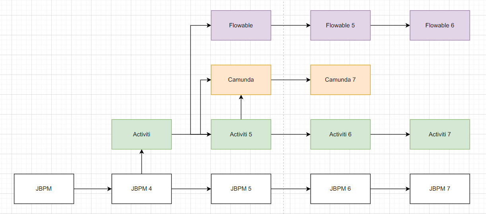
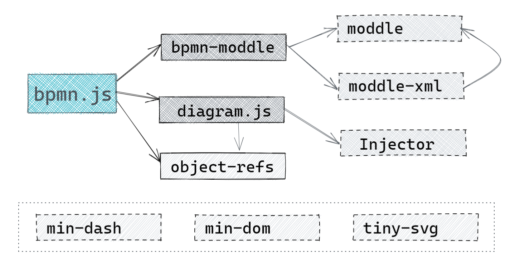
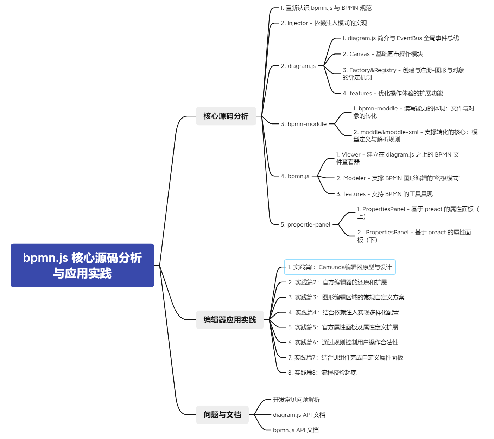

在正式开始介绍 bpmn.js 源码之前，我想先向大家介绍一下与 bpmn.js 相关的一些概念。

根据官网介绍，bpmn.js 作为**符合 BPMN 2.0 标准 XML 文件**的 **阅读器**（Viewer）和 **编辑器**（editor），可以用在 **浏览器** 中创建、嵌入和扩展 BPMN 2.0 文件，也可以独立使用或将其集成到应用程序中。该库内部的核心代码全部由 JavaScript 编写，并且只包含 BPMN 2.0 图文件的相关操作，所以可以脱离后端应用独立运行。

## 那么什么是 BPMN 2.0

BPMN（全称 Business Process Model and Notation，业务流程模型和标记法），是一个全球性的 **标准业务建模及执行标准**，也可以看做是一门 **基于流程图的、开放标准的符号语言**。该标准由 **对象管理组（Object Management Group - OMG）** 进行维护，与其他商业组织无关。BPMN 的前身是由 BPMI（Business Process Management Initiative，业务流程管理倡议组织）开发的 "Business Process Modeling Notation"，即“**业务流程建模标记法**”。之后与 2005 年与 OMG 合并后在 2007 年发布 1.0 版本。

BPMN 2.0 即该标准的 2.0 版本，与 2010 年 12 月正式发布。

> 完整的发展历史和规范完整介绍可以查看 [ABOUT THE BUSINESS PROCESS MODEL AND NOTATION SPECIFICATION VERSION 2.0](https://www.omg.org/spec/BPMN/2.0/)

该标准的主旨是：**通过提供一套既符合业务人员直观又能表现复杂流程语义的标记法，同时为从事业务流程管理的技术人员和业务人员提供支持**。通过引入 XML，结合 BPMN 本身定义的图形标记，可以很好的表达出整个业务流程的细节和走向，后台系统也可以通过解析 XML 来正确识别该业务流程的完整配置。而为了使这些图形标记在 **能够处理流程复杂性的同时又能简单明了、通俗易懂**，BPMN 规范通过定义 **五个基础元素类型**，并且每个类型可以通过添加额外的功能和信息来支持流程的复杂性而不会显著改变元素的基本外观。

这五个基础元素类型是：

1. `Flow Object` 流程对象，也可以称为 `Flow Elements` 流程元素
2. `Data` 数据对象
3. `Connecting Objects` 连接对象，也可以称为 `Connecting Elements` 连接元素
4. `Swimlanes` 泳道对象
5. `Artifacts` 工件对象

其中 `Flow Objects` 流程对象作为 **构成整个业务流程的主要元素对象**，它又分为以下三种元素类型：

1. `Activities` 活动，主要是任务类节点或者子流程节点，表现为一个圆角矩形，在流程中主要表示 **需要执行的工作或者逻辑**，符号为：
2. `Events` 事件，作为 **启动、改变或者完成一个业务流程的触发器节点**，表现为一个圆形，符号为：
3. `Gateways` 网关，作为流程中的一个 **决策点**，一般用于 **根据指定条件决定流程后续走向**，符号为：

而 `Connecting Objects` 连接对象则是用来 **连接流程元素等元素节点并指示其流转/绑定关系**，又分为以下三种元素类型：

1. `Sequence Flows` 序列流，用来指示流程中的业务元素编排与执行顺序，一般显示为带箭头的实线：
2. `Message Flows` 信息流，消息流用于显示消息发送者和消息接收者的之间的消息流传递，一般为带起点和箭头的虚线：
3. `Associations` 关联指示，用于将信息或者扩展工件（例如数据对象）与BPMN图形元素关联链接，某些情况下关联指示上可以显示箭头来指示流动方向，一般显示为 虚线或者带箭头的点状虚线 

`Swimlanes` 泳道则仅包含两种元素，用来组成一个完整的泳道信息：

1. `Pools` 池对象，协作中参与者的图形表示。它还充当一个泳道“和一个用于将一组活动从其他池中分割的图形容器，通常是在B2B环境下。一般“池”都作为一个“黑匣子”，即内部信息不可见，通常显示为带名称栏的大号矩形：
2. `Lanes` 泳道对象，属于 `Pool` 池中的子分区，将垂直或水平地扩展池的整个长度，一般表示为池中非名称栏的每一个矩形元素：

`Data Objects` 数据对象则一般是用来给活动或者流程等注入指定的对象数据，一般显示为一个文件符号，通过 `Associations` 与活动连接：

`Artifacts` 工件对象则一般是作为特殊对象附着在某个其他元素上，根据不同情况有不同的显示形态。

> 以上是这几种类型元素的大致说明，其中 `Activities` 任务节点、`Events` 事件节点、`Gateways` 网关节点等都包含另外的子类型节点，完整的节点类型说明见文档 [Business Process Model and Notation(BPMN) - Version 2.0](http://www.omg.org/spec/BPMN/2.0/) 第七章第二小节：BPMN Elements

**而在一个完整的流程中，至少都包括 `Flow Objects` 和 `Connecting Objects` 两种对象类型，至少包含一个开始事件节点与一个结束事件节点、以及从开始节点到结束节点的流向连线。**

如下图所示：

### BPMN 2.0 与 XML 

在符合 BPMN 2.0 规范下，所有的流程元素都具有一定的 **继承关系**，如下图：

当流程被转成 XML 时，所有的流程节点信息最终都会包含在一个 **Definition 定义节点** 中。假设我们有这样一个流程：

当它转换为 XML 时，则体现为如下格式：

那么 BPMN 规范下的图元素如何与 XML 进行转换呢？

此时就涉及到 **BPMN DI**（BPMN Diagram Interchange，BPMN 图形转换）了。

**BPMN DI** 的诞生本身就位为了促进 BPMN 图 与 XML 之间的互相转换，并且为了保证转换后的 **准确和清晰**，BPMN DI 内部根据 OMG Diagram Definition (DD，图元定义) 划分了两种 **元模型（meta-model）** 类型：

1. **Diagram Commons (DC)**：定义了常见的类型，例如边界和字体
2. **Diagram Interchange (DI)**：提供了用于定义特定于领域的图模型的框架，而 BPMN DI 即是从 DI 类型中派生出来的

一个完整的 BPMN 图，转换成 XML 后，它的 **Business Process Model 业务流程模型** 与 **DI** 都包含在一个 **Definition** 节点中。

其中 **业务流程模型** 数据包含在一个 **process** 或者 **collaboration** 节点中，用于 **定义业务配置与流向**；而与 **图显示** 相关的部分，则位于 **bpmndi** 定义的 **BPMNDiagram** 中，两者通过 **id** 属性进行关联。

### 工作流引擎：BPMN 文件的解析与运行

虽然通过 BPMN2.0 规范可以画出 **业务人员和技术人员都理解的业务流程图**，也可以转换成更专业的 XML 文件。但是如何 **正确解析XML文件并按照定义确保程序的正确执行** 呢？此时就需要用到 **工作流引擎** 了。

**工作流引擎（Workflow Engine，也常简称为 “流程引擎”）**，指将工作流作为应用系统的一部分，并为之提供 **对个应用系统有决定性作用的，可根据角色、分工、条件等信息的不同决定信息传递路由、内容、等级** 等功能的核心解决方案。

目前主流的开源工作流引擎包含 **[JBPM](https://github.com/kiegroup/jbpm)、[Activi](https://github.com/Activiti/Activiti)、[Camunda](https://github.com/camunda/camunda-bpm-platform)、[Flowable](https://github.com/flowable/flowable-engine)**，但这四个的起源都是同一个项目，其大致发展过程如下：

其中 Activiti、Flowable、Camunda 都提供了各自的 **流程图编辑器**，但各自的技术栈不同。而为了支持其他团队的自定义开发，Camunda 团队发布了一个独立的 JavaScript 库 - bpmn.js，用来接入开发者系统代码内支持不同的业务需求。

> 所以 **在与工作流引擎相关的应用开发时，更推荐使用 bpmn.js 来完成相关需求**。

## 认识 bpmn.js

上面介绍了 BPMN 2.0 规范的相关内容，而 bpmn.js 作为 BPMN 文件编辑的老牌js库，它是如何实现在 web 页面进行 BPMN 文件读写和操作的呢？

首先我们根据官方的 [walkthrough](https://bpmn.io/toolkit/bpmn-js/walkthrough/) 来进行一个简单分析。

### 内部结构

在官方的介绍中，bpmn.js 是建立在 **两个底层库**：[diagram.js](https://github.com/bpmn-io/diagram-js) 和 [bpmn-moddle](https://github.com/bpmn-io/bpmn-moddle) 之上的。其中 diagram.js 负责 **图形的绘制和连接**，为使用者提供**与图形元素交互**的方法，并提供了多个扩展的附加工具构造器；而 bpmn-moddle 则定义 BPMN 2.0 规范中提供的 **默认元模型**，**用于读取和解析（写入 web 页面）符合 BPMN 2.0 规范的 XML 文件**。

三者之间的架构与各自功能如下图所示：

### diagram.js

diagram.js 作为 **图形化界面实现的基础依赖**，本身 **默认只提供一个显示界面和相关操作的 API**，需要开发者在此基础上 **根据工具模块来扩展实现自己的编辑器**。而 **模块之间相互依赖则基于 Injector 依赖注入模式，模块之间的功能执行则通过 EventBus 事件总线来触发**。

### bpmn-moddle

作为提供 **BPMN 2.0 规范文件的读写能力** 的模块，内部封装了基础的 **di，dc** 元模型定义文件，以及 BPMN 2.0 相关的 **bpmn，bpmndi** 元模型定义文件。

从 JavaScript 库的角度来看，**bpmn-moddle** 本身建立在 [moddle](https://github.com/bpmn-io/moddle) 和 [moddle-xml](https://github.com/bpmn-io/moddle-xml) 这两个库之上，读写能力也能具象为两个接口：

- [`fromXML`](https://github.com/bpmn-io/bpmn-moddle/blob/master/lib/bpmn-moddle.js#L38)- 从给定的 XML 字符串创建 BPMN 树
- [`toXML`](https://github.com/bpmn-io/bpmn-moddle/blob/master/lib/bpmn-moddle.js#L65)- 将 BPMN 对象树写入 BPMN 2.0 XML

### 源码层面的依赖

通过查看几个库的源代码，其实可以发现除了以上谈到的几个部分，还包含了开发团队抽离的一些 **公共函数库**，例如操作 dom 的 **min-dom**，操作 svg 的 **tiny-svg** 等；另外还有一个 **对象属性双向绑定** 的工具库 **object-refs**。

几个库之间大致关系如下：

## 关于本小册

因为 bpmn.js 的核心逻辑还是通过 **模块依赖注入** 与 **事件总线** 来整合所有功能模块实现 BPMN 图形操作的，不仅内部的扩展功能模块比较多和杂之外，也允许开发者进行自定义模块的注入，所以本小册 **不会按照源码进行逐一讲解，而是解析依赖注入模式和事件总线的实现，以及核心模块的功能和扩展方式**。

结合之前与多个群友之间的交流来看，使用 bpmn.js 的大致难点在于以下几点：

1. 图形元素UI不符合业务要求
2. 属性面板UI不符合要求，并且难以扩展
3. 属性更新与自定义

所以最终确定小册的内容结构为：

1. 源码篇第一部分：Inject 与 diagram.js 核心模块 源码解析
2. 源码篇第二部分：bpmn-moddle 源码解析和 BPMN 元模型定义
3. 源码篇第三部分：bpmn.js 核心模块源码解析
4. 源码篇第四部分：bpmn.js 官方属性面板浅析
5. 实战篇：实现自定义UI与属性面板的Camunda编辑器
6. 问题与文档篇：包含常见问题与API文档

## 阅读收获

如果您购买并耐心阅读完本小册，您可以得到以下内容：

1. BPMN 2.0 基础规范
2. bpmn.js 的实现原理
3. 官方属性面板的原理和扩展
4. UI、属性等各部分的自定义和扩展
5. 一个完整 Web 编辑器的开发过程和注意事项
6. bpmn.js 相关的 API 文档

