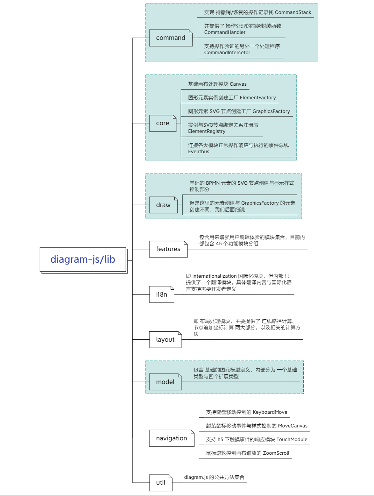
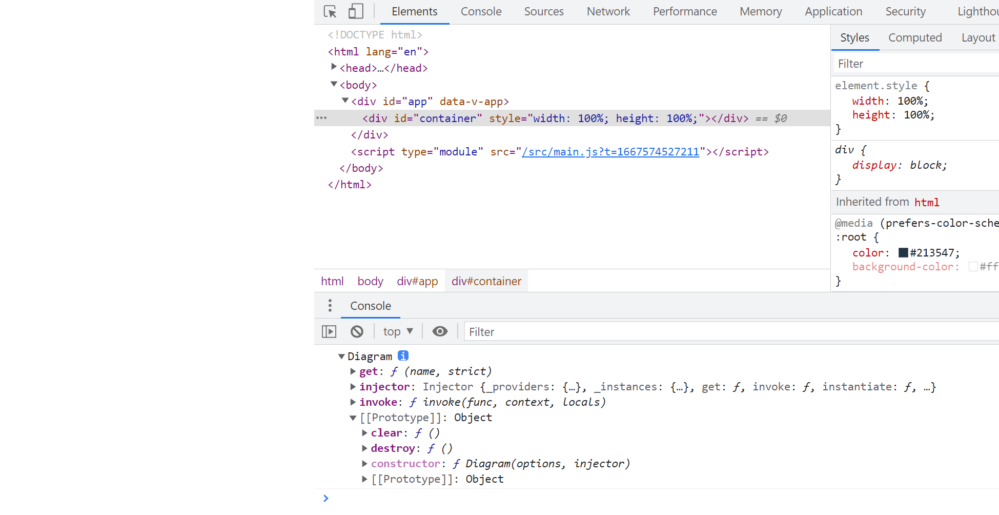
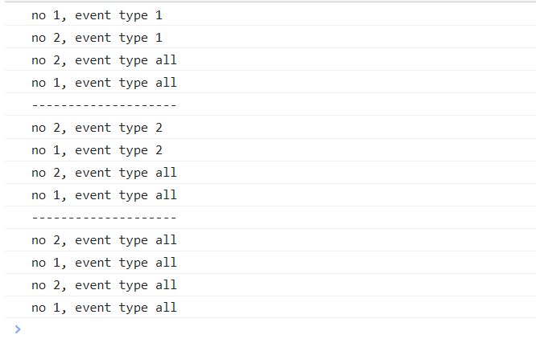
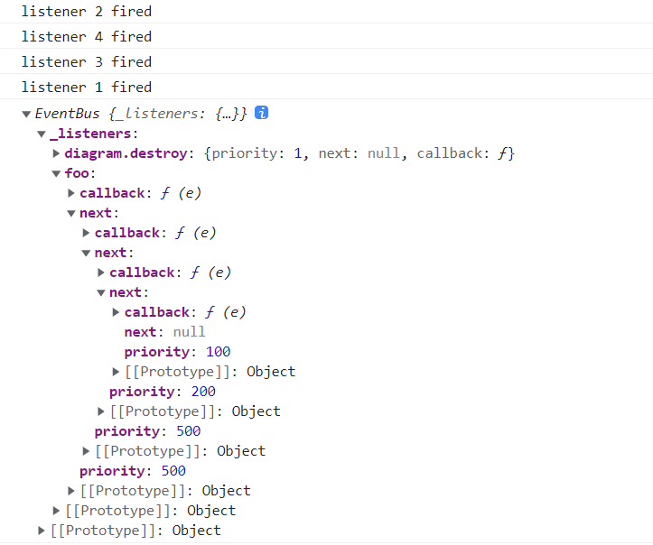
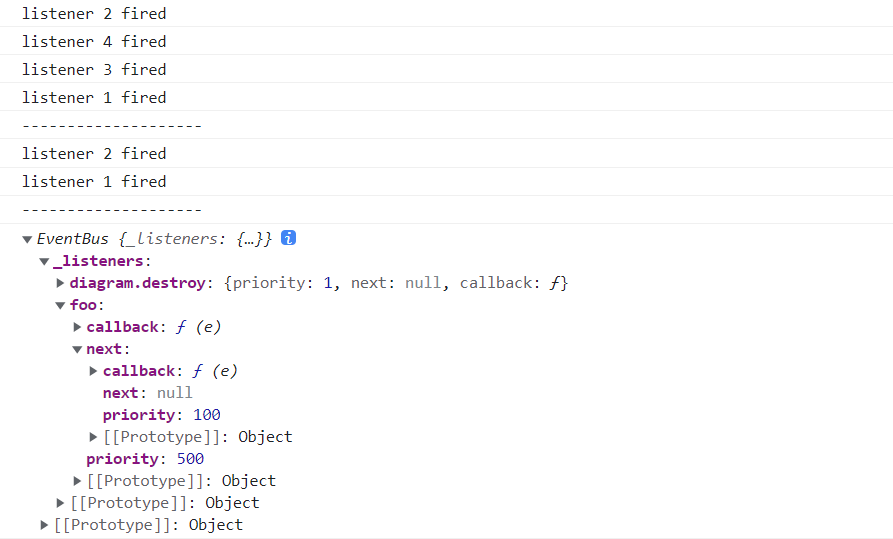
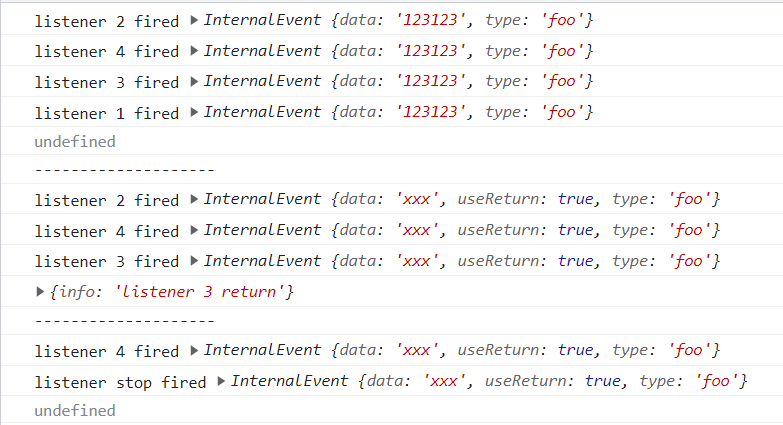

## diagram.js 简介

作为 bpmn.js 的底层库之一，diagram.js 的核心功能就是 **提供 web 端的图形绘制和编辑能力**。其官方定位如下：

> **diagram.js** is a toolbox for displaying and modifying diagrams on the web. It allows us to render visual elements and build interactive experiences on top of them.
>
> It provides us with a very simple module system for building features and dependency injection for service discovery. This system also provides a number of core services that implement the diagram essentials.
>
> Additionally, diagram-js defines a data model for graphical elements and their relationships.

即： 

**diagram.js** 是一个 **用于在 web 页面显示和编辑图形的工具箱**，提供给我们（开发者）**渲染可见元素与元素交互**。并且为我们提供了一个 **非常简单的、基于依赖注入模式的模块化系统，用来构建自定义功能和服务**。

**diagram.js** 也为我们提供了很多 **与绘图相关的核心服务**，并定义了 **图形元素与其对应关系** 的 **数据模型**。

*了解了 diagram.js 的核心目的之后，我们就从它的源码结构开始吧~*

### 源码结构

`diagram.js` 作为使用 node 环境编写的一个 **底层依赖库**，本身并没有代码压缩打包的相关配置，而是只保留了 **Eslint** 配置和 **功能模块** 源码。并且根据 **功能倾向和重要性** 的不同，对 **各个功能模块进行了划分**。

省略掉部分细节和配置文件之后，梳理出来的整个目录结构如下：

```
|-- diagram-js
|  |-- assets
|      |-- diagram-js.css
|  |-- lib
|      |-- command
|      |-- core
|      |-- draw
|      |-- features
|      |-- i18n
|      |-- layout
|      |-- model
|      |-- navigation
|      |-- util
|      |-- Diagram.js
|  |-- index.js
|  |-- package.json
```

其中的 `package.json` 和 `assets/diagram-js.css` 文件大家都能理解，作为基础样式与 node 开发基础配置，剩下的 `lib` 目录自然这个库的所有核心内容。

上面也提到了，`diagram.js` 内部根据不同功能倾向和重要性对各个模块做了拆分，那么拆分后的每个目录下都有哪些模块？分别有什么作用呢？别急，我现在马上为大家揭晓。


`lib` 目录下 9 个文件目录与一个 js 文件，其中 `Diagram.js` 就是这个库的 **入口文件**，剩下 9 个目录分别包含以下内容：

- `command`：核心模块之一，实现 **支持撤销/恢复的操作记录栈 CommandStack**，并提供了 **操作处理的抽象封装函数 CommandHandler** 与 **支持操作验证的另外一个处理程序 CommandInterceptor**
- `core`：核心模块之一，包含 **基础画布处理模块 Canvas**、**图形元素实例创建工厂 ElementFactory**、**图形元素 SVG 节点创建工厂 GraphicsFactory**、**实例与SVG节点绑定关系注册表 ElementRegistry** 和 **连接各大模块正常操作响应与执行的事件总线 Eventbus** 五大模块
- `draw`：核心模块之一，**基础的 BPMN 元素的 SVG 节点创建与显示样式控制部分**，但是这里的元素创建与 GraphicsFactory 的元素创建不同，我们后面细说
- `features`：**包含用来增强用户编辑体验的模块集合**，目前内部包含 45 个功能模块分组
- `i18n`：即 internationalization 国际化模块，但内部 **只提供了一个翻译模块，具体翻译内容与国际化语言支持需要开发者定义**
- `layout`：即 **布局处理模块**，主要提供了 **连线路径计算、节点追加坐标计算** 两大部分，以及相关的计算方法
- `model`：核心模块之一，包含 **基础的图元模型定义**，内部分为 **一个基础类型与四个扩展类型**
- `navigation`：目录名称直译过来可以称为 **“导航”**，主要用来支撑 **交互操作**，包括 **鼠标控制、键盘控制、h5 手势控制等**
- `util`：diagram.js 的公共方法集合

> 大家也可以通过下图进行查看，其中 **绿色标注部分为核心模块**



此时已经了解 diagram.js 中各个部分的大致职责，那么就可以开始分析它的源码逻辑啦~

### 从入口开始

假设在我们开发时直接使用 `import Daigram from 'diagram-js'` 的话，默认入口是 `diagram-js/index.js`，但其中只有一句话：

```javascript
export { default } from './lib/Diagram';
```

所以真实入口还是 `diagram-js/lib` 下的 `Diagram.js` 文件。

```javascript
import { Injector } from 'didi';
import CoreModule from './core';

function bootstrap(modules) {
  var injector = new Injector(modules);
  injector.init();
  return injector;
}

function createInjector(options) {
  options = options || {};
  var configModule = {
    'config': [ 'value', options ]
  };
  var modules = [ configModule, CoreModule ].concat(options.modules || []);
  return bootstrap(modules);
}

export default function Diagram(options, injector) {
  this.injector = injector = injector || createInjector(options);
  
  this.get = injector.get;
  
  this.invoke = injector.invoke;
  
  this.get('eventBus').fire('diagram.init');
}

Diagram.prototype.destroy = function() {
  this.get('eventBus').fire('diagram.destroy');
};

Diagram.prototype.clear = function() {
  this.get('eventBus').fire('diagram.clear');
};
```

可以看到 `Diagram` 本身是一个构造函数，在实例化时会给实例添加三个属性/方法：`injector, get, invoke`，同时通过 **事件总线** 触发一个 **diagram.init 绘图工具实例初始化完成** 的事件。并且 `Diagram` 在原型上也声明了两个方法：`destroy` 销毁 与 `clear` 画布清空重置。

但是，**在 `new Diagram` 的过程中并不会生成画布和影响页面内容，而且原型链上的两个方法仅仅是通过 EventBus 发出对应事件，并不会销毁或者更新 diagram 实例。**

> 例如我们在一个 Vue 3 的应用中引入该库并实例化，然后执行 `destroy` 销毁方法：

```vue
<script setup>
  import { onMounted } from 'vue'
  import Diagram from 'diagram-js'
  
  onMounted(() => {
    const diagram = new Diagram({ container: document.getElementById('container') })
    diagram.destroy()
    console.log(diagram)
  })
</script>

<template>
  <div id="container" style="width: 100%; height: 100%"></div>
</template>
```

那么此时页面显示与控制台打印的内容如下图：



可以发现页面内容依然是空白，**整个 DOM 结构与代码定义的原始结构一致，并且销毁方法并没有对 Diagram 的实例产生任何影响。**

那么我们从实例化过程的第一步开始。

### 实例化过程

在我们的例子中，我们执行 `new Diagram()` 时只传递了第一个参数（其实 bpmn.js 实例化时也是一样），而 `Diagram` 是可以接收两个参数的。

```javascript
/**
 * @param {Object} options
 * @param {Array<Module>} [options.modules] 用于 diagram 实例的扩展模块
 * @param {Injector} [injector] 可选参数，一个依赖注入实例，用来初始化 diagram
 */
export default function Diagram(options, injector) {
  this.injector = injector = injector || createInjector(options);
}
```

- `options`：包含一个 `Module[]` 类型的可选属性 `modules` 的普通对象
- `injector`：属于 `Injector` 实例的一个 **依赖注入器**，属于可选参数；为空时会调用内部的 `createInjector` 方法根据 `options` 创建一个 `Injector` 实例


然后在回过头来查看 `createInjector` 和 `bootstrap` 方法，以及整个实例化过程，可以发现这个过程就是 **根据配置实例化一个依赖注入系统绑定到 diagram 实例上，并将所有配置项 `options` 作为一个配置依赖模块 `config` 与默认的核心模块 `CoreModules` 添加到依赖系统中，最后通过 `EventBus` 事件总线发送一个 `diagram.init` 的事件**。

> `config` 配置模块我们都知道是我们传递的参数，此时就是包含 `container` dom节点的对象；那么它的默认核心模块有那些呢？让我们进入对应文件一探究竟


进入 `diagram-js/lib/core/index.js` 之后，可以发现就是引入的 **core** 目录下的几大模块，并依赖 **draw** 绘制模块。

```javascript
///// diagram-js/lib/core/index.js
import DrawModule from '../draw';

import Canvas from './Canvas';
import ElementRegistry from './ElementRegistry';
import ElementFactory from './ElementFactory';
import EventBus from './EventBus';
import GraphicsFactory from './GraphicsFactory';

export default {
  __depends__: [ DrawModule ],
  __init__: [ 'canvas' ],
  canvas: [ 'type', Canvas ],
  elementRegistry: [ 'type', ElementRegistry ],
  elementFactory: [ 'type', ElementFactory ],
  eventBus: [ 'type', EventBus ],
  graphicsFactory: [ 'type', GraphicsFactory ]
};

///// diagram-js/lib/draw/index.js
import DefaultRenderer from './DefaultRenderer';
import Styles from './Styles';

export default {
  __init__: [ 'defaultRenderer' ],
  defaultRenderer: [ 'type', DefaultRenderer ],
  styles: [ 'type', Styles ]
};
```

在初始化时，这些 `type` 构造函数类型模块都会被执行一次实例化，并将实例保存到依赖系统中。而且，**默认情况下的 `Diagram` 实例仅包含以上几个核心依赖，而不包含其他工具模块**。

> 但是 `Diagram` 实例的 `Injector` 中，此时已经包含了当前所有依赖的实例对象。那如果在 `bootstrap` 方法中没有执行 `injector.init()` 的话，会实例化多少个依赖对象呢？大家可以思考一下~

## EventBus 事件总线

在 `Injector` 实例创建完成之后，还会进行一次代理，将 `Injector` 实例的 `get` 和 `invoke` 方法代理到 `Diagram` 实例上，以方便后面的使用。

最后就会调用 `EventBus` 模块发送一个 `diagram.init` 的事件来触发其他依赖的执行。这里就提示了我们另外一个核心点 —— **事件总线**。

在 `diagram.js` 与 `bpmn.js` 等其他扩展库中，**EventBus 事件总线模块是串联所有模块正常按顺序工作的基础**，其他模块都可以通过调用该模块注册或者发送事件。

### 什么是事件总线

在计算机中，**总线（bus）** 一般是指计算机各个功能部件之间用来传递信息的公共通信干线，而 **事件总线（EventBus）**，则是 **程序语言中实现“发布-订阅模式”的一种手段**，其最常用的作用就是用来 **连接不同模块之间的消息通信和数据传递**。

在日常的开发过程中，我们可以通过引入像 `mitt` 这样的 **第三方实现库** 来使用事件总线，也可以使用 **闭包函数或者构造函数** 等方式来自定义一个事件总线，甚至像 Vue 2 这样的库还可以直接使用一个实例来进行消息通信。

最简单的一类消息总线， **至少会包含一个注册事件监听的方法（一般称为 `on` 或者 `addListener`）、一个取消事件监听的方法（一般称为 `off` 或者 `removeListener`）、一个发送事件与数据方法（一般称为 `fire` 或者 `emit`），和一个私有的用来保存事件与订阅列表的 Map 对象**

以 `mitt` 为例我们来分析一下一个最简单的事件总线的功能和用法：

```js
export default function mitt(all) {
  all = all || new Map()
  
  return {
    all,
    on(type, handler) {
      const handlers = all.get(type)
      if (handlers) {
        handlers.push(handler)
      } else {
        all.set(type, [handler])
      }
    },
    off(type, handler) {
      const handlers = all.get(type)
      if (handler) {
        handlers.splice(handlers.indexOf(handler) >>> 0, 1)
      } else {
        all.set(type, [])
      }
    },
    emit(type, event) {
      let handlers = all.get(type)
      
      if (handlers) {
        handlers.slice().map((handler) => handler(evt));
      }
      handlers = all.get('*');
      if (handlers) {
        handlers.slice().map((handler) => handler(type, evt));
      }
    }
  }
}

// 使用
import mitt from 'mitt'
const eventBus = mitt()
```

`mitt` 在保存所用订阅事件时是使用的 `Map` 来进行保存的，并且也返回了保存订阅事件的 `Map` 地址 `all`，所以我们可以通过 `eventBus.all.clear()` 直接调用 `Map` 本身的 `clear` 方法去清空所有的订阅事件。

另外提供了三个方法：

- `on`：注册一个事件 `type` 对应的处理函数 `handler`
- `off`：移除一个事件 `type` 对应的处理函数，指定处理函数 `handler` 时 **仅移除指定的处理函数**，否则移除该事件对应的所有处理函数
- `emit`：发布一个事件，找到所有订阅该事件的处理函数并执行（如果有事件订阅的是 `*`，也会触发那些订阅）

例如：

```js
import mitt from 'mitt'
const eventBus = mitt()

eventBus.on('ev1', () => console.log('no 1, event type 1'))
eventBus.on('ev2', () => console.log('no 2, event type 2'))
eventBus.on('ev2', () => console.log('no 1, event type 2'))
eventBus.on('ev1', () => console.log('no 2, event type 1'))
eventBus.on('*', () => console.log('no 2, event type all'))
eventBus.on('*', () => console.log('no 1, event type all'))

eventBus.emit('ev1')
console.log('--------------------')
eventBus.emit('ev2')
console.log('--------------------')
eventBus.emit('*')
```

> 大家可以猜猜 `emit('*')` 时会发生什么？

此时正常打印结果如下：



可以发现，**正在正常注册事件订阅时，按指定类型触发事件的话，只会触发指定事件类型的订阅器和 `*` 类型的全局订阅器**；但是，在我们发送一个 `*` 类型的事件时，则每个全局订阅器都会触发两次（这个个人理解也不算 bug，毕竟一般也没有人会用 `*` 来注册事件订阅）。

不过这个事件总线也有一些 **缺点**，例如：

- 不能指定订阅器 `handler` 的上下文
- 不能配置只触发一次的订阅器 `handler`，也就是 `once` 注册
- 不能限制最大订阅数量（虽然一般很少用）

针对这些问题，我特地写了一个功能比较全面的事件总线类，但由于篇幅有限，代码存放在 [github](https://github.com/miyuesc/some-tool-functions/blob/main/functions/EventEmitter.js) 了，大家可以复制下来试验一下。

> 不过，此时的事件总线仍然还有一个很严重的问题，**默认都是按订阅注册的顺序执行，在绘图过程中因为每个模块的定义顺序或者自定义模块覆盖，如果采用这种方式的话，很有可能每个模块没有办法按照我们的预期效果执行**。
>
> 那么 `diagram.js` 中是如何解决这个问题的呢？答案就是 **给每个事件订阅增加一个权重，按照权重优先级结合注册顺序来确定最终的订阅器执行**。

### `diagram.js` 中 `EventBus` 的权重设计

既然涉及到了 **权重** 和 **注册顺序**，那么继续使用列表的形式来保存每个事件类型的订阅器的话就 **不够优雅和优秀** 了，所以 `diagram.js` 的开发团队设计了一个 **链表** 来保存每个事件的订阅器。

在通过 `eventBus` 注册一个新事件订阅时，会设置一个 **权重值 priority**；默认按照权重 **由高到低的顺序生成链表**，当遇到 **相同权重的订阅器** 时，则按照订阅器的 **注册的先后顺序** 来确定他们在链表中的位置。总的来说就是 **`高权重、先注册 -> 低权重、后注册`** ，而所有的订阅器则 **与普通的事件总线设置一样，以事件类型区分的对象形式保存**。并且为了 **保证中间订阅器出现异常或者需要中断操作时能停止后面订阅器的执行**，`EventBus` 还增加了对应的配置项用来中断执行。

#### **首先，我们先来分析它的事件订阅器的注册过程和保存逻辑**

```js
var FN_REF = '__fn';
var DEFAULT_PRIORITY = 1000;
export default function EventBus() {
  this._listeners = {};
  this.on('diagram.destroy', 1, this._destroy, this);
}

EventBus.prototype.on = function(events, priority, callback, that) {
  events = isArray(events) ? events : [ events ];

  if (isFunction(priority)) {
    that = callback;
    callback = priority;
    priority = DEFAULT_PRIORITY;
  }

  if (!isNumber(priority)) {
    throw new Error('priority must be a number');
  }

  var actualCallback = callback;

  if (that) {
    actualCallback = bind(callback, that);
    actualCallback[FN_REF] = callback[FN_REF] || callback;
  }

  var self = this;

  events.forEach(function(e) {
    self._addListener(e, {
      priority: priority,
      callback: actualCallback,
      next: null
    });
  });
};
```

> 估计是为了避免兼容问题，这里直接通过字面量的形式声明了一个对象 `_listeners` 用来保存事件和订阅器

`on` 注册事件订阅的方法，最多接收 4 个参数：

1. `events`：需要订阅的事件名，可以是字符串或者字符串数组
2. `priority`：订阅器权重，默认是 1000，需要优先执行时可以适当增大数值
3. `callback`：订阅器执行函数
4. `that`：用来绑定 `callback` 订阅器函数的执行上下文

其中 `events` 和 `callback` 为必传参数，这里 `events` 可以是 **数组**，说明可以 **同时为多个类型的事件添加同一个订阅器**。

在 `on` 方法中其实最核心的一点就是 `actualCallback = bind(callback, that)`，通过 `bind` 方法强制绑定 `callback` 订阅器回调函数的上下文为传入的 `that`，当然如果 `that` 是空时内部上下文就是 `undefined` 了。

最后 **遍历 `events` 数组** 调用 `_addListener` 来实际操作订阅器的添加：

```js
EventBus.prototype._addListener = function(event, newListener) {
  var listener = this._getListeners(event),
      previousListener;
  
  if (!listener) {
    this._setListeners(event, newListener);
    return;
  }

  while (listener) {
    if (listener.priority < newListener.priority) {
      newListener.next = listener;
      return previousListener ? (previousListener.next = newListener) : this._setListeners(event, newListener);
    }
    previousListener = listener;
    listener = listener.next;
  }
  previousListener.next = newListener;
};


EventBus.prototype._getListeners = function(name) {
  return this._listeners[name];
};

EventBus.prototype._setListeners = function(name, listener) {
  this._listeners[name] = listener;
};
```

**总结一下事件订阅添加的整个过程就是**：

1. 校验和处理参数，通过 `bind` 绑定订阅函数的执行上下文
2. 获取当前事件的所有订阅器，不存在则直接将当前订阅器保存仅 `_listeners` 对象中
3. 遍历订阅链表，找到 `priority` 权重值小于新增订阅器权重值的订阅器，将当前的订阅器插入到它前面

> 但是 `events` 参数传递数组时没有校验数组元素是否重复，也就是如果注册时传递一个 `['foo', 'foo']` 这样的 `events` 参数，则对应的订阅器会注册 **两次**。

整个链表的每个节点的参数可以参考 `_addListener` 时传递的对象，包含三个属性：

1. `callback`：已经绑定过执行上下文的订阅函数
2. `priority`：权重值
3. `next`：当前节点的下一节点

例如我们现在定义这样 4 个同事件的订阅函数，然后注册并触发事件：

```js
const listener1 = function (e) {
  console.log('listener 1 fired')
}

const listener2 = function (e) {
  console.log('listener 2 fired')
}

const listener3 = function (e) {
  console.log('listener 3 fired')
}

const listener4 = function (e) {
  console.log('listener 4 fired')
}

eventBus.on('foo', 100, listener1)
eventBus.on('foo', 500, listener2)
eventBus.on('foo', 200, listener3)
eventBus.on('foo', 500, listener4)

eventBus.fire('foo')
console.log(eventBus)
```

按照我们之前的分析，订阅器的执行顺序应该是：`listener2 > listener4 > listener3 > listener1`，那么我们执行一下看看结果吧。



可以看到结果和订阅的保存方式跟我们预想的确实是一样的~

#### 只执行一次的订阅器

但是上面介绍的通过 `on` 注册的订阅器在每次事件触发时都会执行，那只执行一次的订阅器怎么注册呢？有没有什么影响？这就要说到另一个注册方法 `once` 了。

本身 `once` 最后也是通过 `on` 来讲订阅器插入到订阅链表中，但是中间会多一步处理，源码如下：

```js
EventBus.prototype.once = function(event, priority, callback, that) {
  var self = this;
  // 参数校验 与 on 一致，但是只校验 priority 和 callback

  function wrappedCallback() {
    wrappedCallback.__isTomb = true;
    var result = callback.apply(that, arguments);
    self.off(event, wrappedCallback);
    return result;
  }
  
  wrappedCallback[FN_REF] = callback;

  this.on(event, priority, wrappedCallback);
};
```

**与 `on` 不同的就是：增加了一个“已执行”标识 `__isTomb`，通过 `apply` 直接改变订阅函数的上下文执行一次；最后调用 `off` 移除掉该订阅**。

假设我们还是上面的那几个函数，只是改变一下注册方式：

```js
eventBus.on('foo', 100, listener1)
eventBus.on('foo', 500, listener2)
eventBus.once('foo', 200, listener3)
eventBus.once('foo', 500, listener4)

eventBus.fire('foo', param)
console.log('--------------------')
eventBus.fire('foo', param)
console.log('--------------------')
console.log(eventBus)
```

此时就只会打印以下内容：



#### 订阅器的执行：数据共享和可中断

上面还提到了另外一个特点，就是 **`EventBus` 可以在某个订阅器上“中断”向后继续执行**，那么这个又是怎么实现的呢？我们首先从它的事件触发/订阅器执行开始。

```js
EventBus.prototype.fire = function(type, data) {
  var event,
      firstListener,
      returnValue,
      args;

  args = slice.call(arguments);

  if (typeof type === 'object') {
    data = type;
    type = data.type;
  }

  if (!type) {
    throw new Error('no event type specified');
  }

  firstListener = this._listeners[type];

  if (!firstListener) {
    return;
  }
  
  if (data instanceof InternalEvent) {
    event = data;
  } else {
    event = this.createEvent(data);
  }
  args[0] = event;
  var originalType = event.type;
  if (type !== originalType) {
    event.type = type;
  }

  try {
    returnValue = this._invokeListeners(event, args, firstListener);
  } finally {
    if (type !== originalType) {
      event.type = originalType;
    }
  }

  if (returnValue === undefined && event.defaultPrevented) {
    returnValue = false;
  }

  return returnValue;
};
EventBus.prototype._invokeListeners = function(event, args, listener) {
  var returnValue;
  
  while (listener) {
    if (event.cancelBubble) {
      break;
    }
    returnValue = this._invokeListener(event, args, listener);
    listener = listener.next;
  }
  return returnValue;
};
EventBus.prototype._invokeListener = function(event, args, listener) {
  var returnValue;

  if (listener.callback.__isTomb) {
    return returnValue;
  }
  try {
    returnValue = invokeFunction(listener.callback, args);
    if (returnValue !== undefined) {
      event.returnValue = returnValue;
      event.stopPropagation();
    }
    if (returnValue === false) {
      event.preventDefault();
    }
  } catch (error) {
    if (!this.handleError(error)) {
      console.error('unhandled error in event listener', error);
      throw error;
    }
  }
  return returnValue;
};
EventBus.prototype.createEvent = function(data) {
  var event = new InternalEvent();
  event.init(data);
  return event;
};

function InternalEvent() { }
InternalEvent.prototype.stopPropagation = function() {
  this.cancelBubble = true;
};
InternalEvent.prototype.preventDefault = function() {
  this.defaultPrevented = true;
};
InternalEvent.prototype.init = function(data) {
  assign(this, data || {});
};
```

这里可以发现，在通过 `fire` 发送一个事件时，首先处理的是 **参数合法性**，当通过这个事件发送的数据对象 `data` 不是 `InternalEvent` 类型时会对其进行一次重新包装。而 `InternalEvent` 则是在原数据对象的基础上增加了 **两个标志位：`cancelBubble` 中断向后执行；`defaultPrevented` 在没有显示返回值时返回 `false` 而非 `undefined`**。

然后则是处理 `data` 中的 `type` 字段，因为本身 **`fire` 可以只传递一个对象参数，将 `type` 放在 `data` 对象中指定需要触发的事件**；但如果 **同时传递了 `type` 与 `data` 数据，则有可能 `data` 中的 `type` 字段需要参与其他业务，需要将 `data.type` 保存一个备份然后在所有订阅函数执行结束后重新恢复**。

随后，就是调用 `_invokeListeners` 去遍历订阅链表分别执行每一个订阅函数，并保留返回值传递给 `fire` 用来判断和返回。

在执行订阅函数的时候，使用的是 `_invokeListener` 方法，但是这里需要注意以下几个内容：

1. `once` 注册的订阅函数具有一个 `__isTomb` 标识，**再次** 执行到时会直接返回 `undefined`
2. 然后就是通过 `apply` 运行订阅函数，获取函数返回值
3. **特别注意1**：如果订阅函数 **有具体返回值且不为 `undefined`，则会中断后续订阅函数的执行**
4. **特别注意2**：如果订阅函数 **返回了 `false`，除了中断后续订阅的执行，还会触发 `preventDefault` 方法**

####  订阅器的移除

至于移除订阅器的方法，则和普通的事件总线类似。

`EventBus` 移除订阅器的方法是 `off`，最多接收两个参数: `events` 和 `callback`。与 `on` 类似，`events` 可以是一个字符串或者字符串数组，但 `callback` 此时可以为空；当没有指定 `callback` 时，会移除指定事件类型的所有订阅，而指定后只会移除特定的某个订阅函数。


为了省点儿篇幅，这里把执行和移除统一放一个示例吧：

```
import EventBus from 'diagram-js/lib/core/EventBus.js'

const eventBus = new EventBus()

const listener1 = function (e) {
  console.log('listener 1 fired', e)
}
const listener2 = function (e) {
  console.log('listener 2 fired', e)
}
const listener3 = function (e) {
  console.log('listener 3 fired', e)
  if (e.useReturn) {
    return {
      info: 'listener 3 return'
    }
  }
}
const listener4 = function (e) {
  console.log('listener 4 fired', e)
}
const listenerStopPropagation = function (e) {
  console.log('listener stop fired', e)
  e.stopPropagation()
}

// 注册事件
eventBus.on('foo', 100, listener1)
eventBus.on('foo', 500, listener2)
eventBus.on('foo', 200, listener3)
eventBus.on('foo', 500, listener4)

// 发送事件

// 场景1
console.log(eventBus.fire('foo', { data: '123123', type: 'xxx' }))
console.log('--------------------')

// 场景2
console.log(eventBus.fire('foo', { data: 'xxx', useReturn: true }))
console.log('--------------------')

// 场景3
eventBus.off('foo', listener2)
eventBus.on('foo', 300, listenerStopPropagation)
// 重新发送事件
console.log(eventBus.fire('foo', { data: 'xxx', useReturn: true }))
```

大家也可以先估计一下每次都会执行哪些订阅函数，分别打印什么内容。

最后打印结果如下：



**简单分析一下出现这种情况的原因**：

- 场景1：在此时所有的已注册监听函数的顺序为：`2 => 4 => 3 => 1`，并且中途 **没有函数有直接 `return` 和调用 `stopPropagation`**，所以每个监听函数的执行顺序不受影响，正常输出；但一样是因为最后的 `listener1` 也没有返回值，所以最终返回值是 `undefined`
- 场景2：因为 `fire` 发送事件时参数中有一个 `useReturn`，会触发 `listener3` 显示返回一个对象，所以此时会在 `listener3` 执行结束后终止后续事件传播，最终打印顺序为 `2 => 4 => 3`，并且返回值为 `listener3` 的显示返回值
- 场景3：因为在发送事件前移除了 `listener2`，并重新注册一个内部调用 `stopPropagation` 阻止传播方法且权重为 300 的监听函数 `listenerStopPropagation`，此时链表中的监听函数顺序为 `4 => listenerStopPropagation => 3 => 1`；正常情况下如果 `listenerStopPropagation` 中没有执行 `stopPropagation` 方法的话，该事件的返回值应该与场景2一致，但由于中间调用了终止方法，将在执行到 `listenerStopPropagation ` 时停止向后传播，并且没有设置显示返回值，所以最终打印 `listener4` 和 `listenerStopPropagation` 并返回 `undefined`

## 本章小结

总的来说，`diagram.js` 虽然是作为 `bpmn.js` 的底层项目，用来提供绘图能力与交互能力，并实现了一些工具函数；但是 **本身并没有实现太多功能，只是作为初始化依赖注入器与基础模块的入口**，通过 `Injector` 引用并触发一个事件用来实例化每个依赖对象（功能模块）。

而 `EventBus` 则是作为 **串联所有模块正常工作与信息传递的核心模块**，并在传统事件总线的基础上 **增加了权重顺序和中断执行的操作**，个人理解这两个特点的最大作用就是 **用来增加每个功能操作执行前的校验**，如果某个操作进行时数据不合法则可以通过 `stopPropagation` 方法直接终止后续订阅器的执行。


