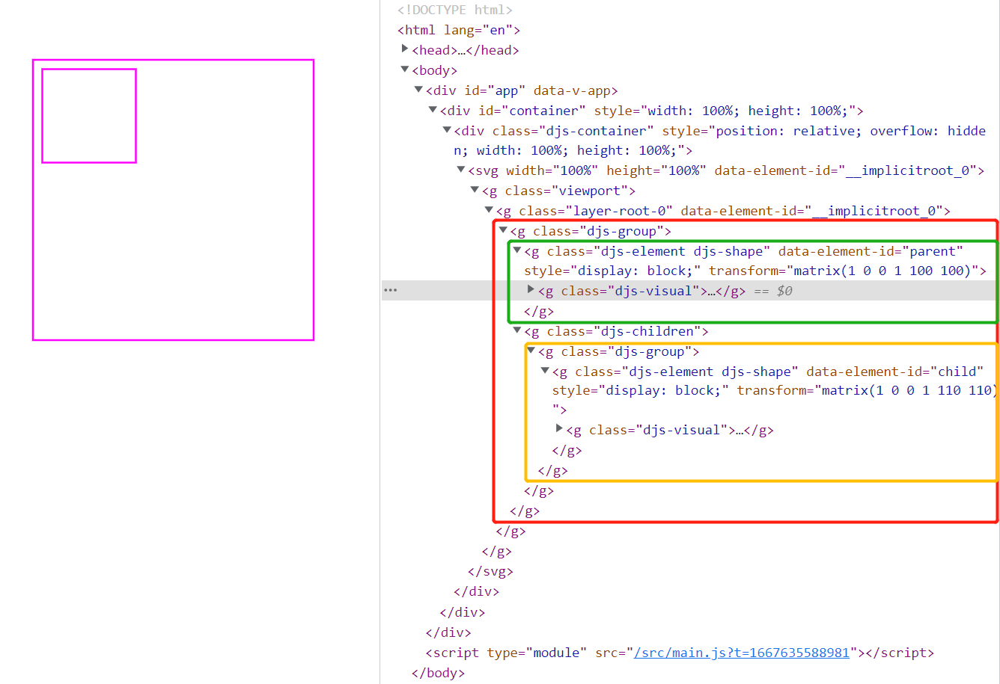

在上一节的 `diagram.js` 简介部分，有提到过我们在 `new` 一个 `Diagram` 实例时，实际是将配置项和 `CoreModule` 核心模块放在一起之后用来 **初始化依赖注入系统并绑定到 `Diagram` 实例上**，并且在 `Injector` 实例化创建完成之后，立即调用了 `injector.init` 方法。

在 `CoreModule` 中，`__init__` 配置里添加了一个 `canvas`，所以在 `injector.init()` 时才会在页面上创建一个 SVG 画布（当然上一节里面的 `new Diagram()` 的方式最终是没有在 DOM 上生成 SVG 节点的，这是因为我们的配置参数有问题）。

## Canvas：基础画布与元素处理模块

也可以看做是 **主画布构建及画布内元素操作模块**，除了最基础的 **SVG 画布区域** 的创建和销毁，也提供了画布区域内 **所有元素节点的增删查改** 等操作。

因为源码太长（超过 1400 行），所以这里只放部分源码和方法，有兴趣的同学可以 [点击该链接查看 Canvas 的最新源码](https://github.com/bpmn-io/diagram-js/blob/develop/lib/core/Canvas.js)。

### 实例化过程

既然是一个构造函数类型的模块，那我们就从它的实例化过程开始吧

```javascript
export default function Canvas(config, eventBus, graphicsFactory, elementRegistry) {
  this._eventBus = eventBus;
  this._elementRegistry = elementRegistry;
  this._graphicsFactory = graphicsFactory;
  this._rootsIdx = 0; // 根元素 Id
  this._layers = {}; // 所有的"图层"集合
  this._planes = []; // 画布内根元素集合
  this._rootElement = null; // 画布根元素对应的实例
  this._init(config || {});
}

Canvas.$inject = [ 'config.canvas', 'eventBus', 'graphicsFactory', 'elementRegistry' ];

Canvas.prototype._init = function(config) {
  const eventBus = this._eventBus;
  const container = this._container = createContainer(config);
  
  // 创建 div 节点与 SVG 画布节点，并生成一个 视窗分组 g.viewport
  const svg = this._svg = svgCreate('svg');
  svgAttr(svg, { width: '100%', height: '100%' });
  svgAppend(container, svg);
  const viewport = this._viewport = createGroup(svg, 'viewport');

  // 确认否是需要根据变化 立即 更新画布视图，一般都是不即时更新
  if (config.deferUpdate !== false) {
    this._viewboxChanged = debounce(bind(this._viewboxChanged, this), 300);
  }

  // 注册 diagram.init 事件的响应，发送出 canvas.init 画布已实例化的事件
  eventBus.on('diagram.init', function() {
    eventBus.fire('canvas.init', { svg: svg, viewport: viewport });
  }, this);
  
  eventBus.on([
    'shape.added', // 形状元素新增结束
    'connection.added', // 连线元素创建结束
    'shape.removed', // 形状元素被移除后
    'connection.removed', // 连线元素被移除后
    'elements.changed', // 元素配置发生改变
    'root.set' // 根元素配置改变
  ], function() {
    delete this._cachedViewbox;
  }, this);

  // diagram 根实例销毁时
  eventBus.on('diagram.destroy', 500, this._destroy, this);
  // diagram 根实例触发画布清空时
  eventBus.on('diagram.clear', 500, this._clear, this);
};

// 销毁事件：发送 canvas.destroy 事件，并从 dom 中移除掉生成的 div 节点，然后删除实例的相关属性
Canvas.prototype._destroy = function(emit) {
  this._eventBus.fire('canvas.destroy', {
    svg: this._svg,
    viewport: this._viewport
  });
  const parent = this._container.parentNode;
  if (parent) {
    parent.removeChild(this._container);
  }
  delete this._svg;
  delete this._container;
  delete this._layers;
  delete this._planes;
  delete this._rootElement;
  delete this._viewport;
};

// 画布清空，即从注册表中获取到所有元素的元素实例，将所有节点对应的 svg 元素都从画布中移除，并清空相关实例属性
Canvas.prototype._clear = function() {
  const allElements = this._elementRegistry.getAll();
  allElements.forEach(element => {
    const type = getType(element);
    if (type === 'root') {
      this.removeRootElement(element);
    } else {
      this._removeElement(element, type);
    }
  });
  this._planes = [];
  this._rootElement = null;
  delete this._cachedViewbox;
};

///// helpers
function createContainer(options) {
  options = assign({}, { width: '100%', height: '100%' }, options);
  const container = options.container || document.body;
  const parent = document.createElement('div');
  parent.setAttribute('class', 'djs-container');
  assignStyle(parent, {
    position: 'relative',
    overflow: 'hidden',
    width: ensurePx(options.width),
    height: ensurePx(options.height)
  });
  container.appendChild(parent);
  return parent;
}
```

简单分析一下：

在 `injector.init()` 时依赖注入系统会去初始化一次所有 `__init__` 配置中指定的依赖模块，所以这里也会直接实例化一次 `Canvas`。

而通过 `Canvas.$inject = ['config.canvas', 'eventBus', 'graphicsFactory', 'elementRegistry']` 可以知道 `Canvas` 默认依赖 **`config` 配置、`EventBus` 事件总线、`GraphicsFactory` SVG元素创建、`ElementRegistry` 元素与节点注册表**（所以这些模块也会生成一个对应实例）。

并且在初始化过程中会根据传递的 **`config.canvas.container` 指定的 DOM 节点**，在该节点下创建一个 **具有一个 SVG 子节点且都继承父元素尺寸的、class 类名为 `djs-container` 的 `div` 节点**，作为我们的画布区域；并且会 **设置一系列的事件监听回调来更新视图状态或者销毁元素/画布**。

> 这也是我们上一节直接 `new Diagram()` 时 dom 结构上没有生成 SVG 节点的原因。

在 `new Diagram(options)` 时，所有的 `options` 配置项都被作为一个 `config` 依赖对象保存在了 `Injector` 依赖注入系统中；而 `Canvas` 依赖 `config.canvas`，其实也就是我们的 `options.canvas`。

所以我们如果 **要在 html 结构上正常挂载 svg 画布节点的话，需要在 `new Diagram()` 时传递以下配置**

```vue
<script setup>
  import Diagram from 'diagram-js'
  import { onMounted } from 'vue'
  onMounted(() => {
    const diagram = new Diagram({ canvas: { container: document.getElementById('container') } })
    console.log(diagram)
    console.log(diagram.get('canvas'))
  })
</script>
```

此时就能得到以下结果，并且可以通过 `diagram.get('canvas')` 获取到当前的 `Canvas` 实例：


在 **Canvas 实例** 中会有一个属性 `_container` 记录 svg 挂载的 div 节点，一个 `_svg` 属性用来保存 svg 画布节点；另外还有一个属性 `_viewport`，用来记录 **当前画布内所有元素的组合**。

> **上面说了，`Canvas` 模块还会负责画布内 元素的增删改查**，具体是怎么实现的呢？

### 首先是 “创建” 元素

`Canvas` 模块在原型上定义了三个方法用来添加元素，分别是：

- `addShape`：添加 **形状元素**
- `addConnection`：添加 **连线元素**
- `addRootElement`：添加一个 **根节点实例(隐藏的图层)**

最终 `addShape` 和 `addConnection` 都会调用 **原型上的私有方法（只是命名上的区分）`_addElement()`** 来实现元素的添加，期间主要处理以下逻辑：

1. 查找到画布内的 **图层根元素**（也就是 `canvas._rootElement`，没有则会创建一个），并校验元素的 id 合法性和参数完整性
2. 发送 `shape.add/connection.add` 事件
3. 设置新元素实例的父级为 `canvas._rootElement`，通过 `graphicsFactory` 实例来创建一个 **svg 分组**，并**向 `ElementRegistry` 注册表中插入一条新的元素实例与SVG节点的对应关系**
4. 通过 `graphicsFactory` 将生成的 **svg 分组标签** 插入到画布中，发送 `shape.added/connection.added` 事件，最后返回该元素实例。

其源码如下：

```js
Canvas.prototype._addElement = function(type, element, parent, parentIndex) {
	// 查找根元素
  parent = parent || this.getRootElement();

  const eventBus = this._eventBus,
        graphicsFactory = this._graphicsFactory;

  // 校验 ID 合法性和参数完整性
  this._ensureValid(type, element);

  // 发送对应事件
  eventBus.fire(type + '.add', { element: element, parent: parent });

  this._setParent(element, parent, parentIndex);

  // 生成对应的元素包装节点（也就是 g.djs-group, g.djs-element 等）
  const gfx = graphicsFactory.create(type, element, parentIndex);

  // 注册相应实例-元素对应关系
  this._elementRegistry.add(element, gfx);

  // 更新元素的可见节点
  graphicsFactory.update(type, element, gfx);

  // 发送添加结束的事件
  eventBus.fire(type + '.added', { element: element, gfx: gfx });

  return element;
};
```

假设我们现在通过 `Canvas` 模块创建几个元素：

```javascript
const diagram = new Diagram({ canvas: { container: document.getElementById('container') } })
const canvas = diagram.get('canvas')

canvas.addShape({ id: 's1', x: 10, y: 10, width: 30, height: 30 })
canvas.addShape({ id: 's2', x: 100, y: 100, width: 30, height: 30 })
canvas.addConnection({ id: 'c1', waypoints: [{ x: 25, y: 25 }, { x: 115, y: 115 }] })
```

就可以得到如下结果，且 `ElementRegistry` 也会注册对应数据：


> 这里有同学会发现，注册表中还多了一个 `__implicitroot_0` 的数据，且 `canvas._rootElement` 此时也不是 `null` 了。这就要说到 `addRootElement` 方法了。


与 `addShape，addConnection` 不同的是，`addRootElement` 方法并不是用来创建可见元素的，而是用来 **创建一个可见元素的挂载区域分组，也可以看做是一个图层**。当我们首次执行 `addShape` h或者 `addConnection` 时，需要查找 `canvas._rootElement`，但是此时这个属性是个空值，那么 `canvas` 就会执行 `canvas.setRootElement(canvas.addRootElement(null))` 来创建并挂载这个跟图层到 `g.viewport` 下。


> 那如果我想在某一个元素下面添加子元素而不是直接添加到根画布上呢？答案也是可以的。

`addShape` 与 `addConnection` 两个方法除了接收需要添加的元素配置之外，**也接收指定父级元素 `parent` 与指定图层 parentIndex**。例如：

```javascript
const diagram = new Diagram({ canvas: { container: document.getElementById('container') } })
const canvas = diagram.get('canvas')

const parentShape = canvas.addShape({ id: 'parent', x: 100, y: 100, width: 300, height: 300 })
canvas.addShape({ id: 'child', x: 110, y: 110, width: 100, height: 100 }, parentShape)
```

得到如下结果：



其中红色部分是 `parentShape` 添加时创建的分组，中间绿色部分就是我们配置的父元素；而子元素则会 **在父元素分组内单独新增一个分组，用来存放所有子元素节点**。


### 紧接着就是 “查找” 元素

`Canvas` 模块的查找主要分为一下几种模式：

1. `getGraphics`：就是 **根据 id 或者元素实例查找对应的 svg 节点**，内部依赖的其实就是 `ElementRegistry` 注册表模块。因为 **每次新增元素的时候都会在注册表中插入一条数据保存元素实例和 SVG 节点的对应关系**，所以通过注册表来查找是最快捷的方法，并且不需要遍历整个SVG画布。
2. `getRootElement/getRootElements`：分别用来 **获取当前激活的根元素和获取所有的根元素列表**。当不存在 `rootElement` 时，`getRootElement` 还是创建一个新的 `rootElement` 再返回（这个方法在使用流程编辑时用来获取流程节点很好用）。
3. `getContainer`：用来获取生成的 `div.djs-container` 节点
4. `getLayer, getActiveLayer, getDefaultLayer`：用来获取图层列表、当前活动图层、默认图层。**图层在 `Canvas` 中具体体现为 `g.viewport` 下面的每一个 `g` 分组标签（细节在后面图层一小节再讲）**。

总的来说，“查找”一类的功能就是 **通过查询条件从已保存的数据中筛选出符合条件的部分返回，基本上不会去进行 dom 操作**；只有 `getRootElement、getDefaultLayer` 这两个 API 会在查询不到结果时自动创建一个对应元素再返回。


### 然后就是 “删除” 元素

与 “新增” 元素的写法类似，删除元素有两个方法 `removeShape` 和 `removeConnection`，且两个方法都通过调用私有方法 `_removeElement` 实现；另外也有一个 `removeRootElement` 方法，用来移除指定的某个根节点/图层。

> 当然几个方法都会返回被移除的元素或实例

`_removeElement` 的过程也分为几步：

1. 通过注册表找到指定的元素实例
2. 发送 `shape.remove/connection.remove` 事件
3. 通过 `graphicsFactory` 模块找到元素实例对应的 svg 节点，并移除
4. 从元素实例的父子关系中移除对应的绑定关系
5. 发送 `shape.removed/connection.removed` 事件
6. 从 注册表中移除该元素实例与对应svg节点，并返回被移除对象

其源码部分如下：

```js
Canvas.prototype._removeElement = function(element, type) {

  const elementRegistry = this._elementRegistry,
        graphicsFactory = this._graphicsFactory,
        eventBus = this._eventBus;

  // 查找对应的元素实例
  element = elementRegistry.get(element.id || element);

  // 没有就直接退出
  if (!element) {
    return;
  }

  // 发送 `shape.remove/connection.remove` 事件
  eventBus.fire(type + '.remove', { element: element });

  // 通过 graphicsFactory 模块从 dom 结构中移除对应节点
  graphicsFactory.remove(element);

  // 从元素实例的父子关系中移除对应的绑定关系
  collectionRemove(element.parent && element.parent.children, element);
  element.parent = null;

  // 发送 `shape.removed/connection.removed` 事件
  eventBus.fire(type + '.removed', { element: element });

  // 从注册表中移除该元素实例相关信息
  elementRegistry.remove(element);

  return element;
};
```

假设现在我们生成了这样一个场景：


那么要 **移除 child1 与 c1**，就可以使用以下方式：

```javascript
const canvas = diagram.get('canvas')
canvas.removeShape('child1')
canvas.removeConnection('c1')
```

前后对比如下：


而 `removeRootElement` 用来移除根节点时，需要接收一个指定条件，一般是 **根元素id 或者根元素实例对象**，并且还会移除相应的图层。

```js
Canvas.prototype.removeRootElement = function(rootElement) {
	// 如果是字符串的话，默认一般是 id，会通过注册表查询到对应的实例
  if (typeof rootElement === 'string') {
    rootElement = this._elementRegistry.get(rootElement);
  }

  // 找到对应的 layer 图层，一般是其他节点的根节点 g.layer-xxx
  const plane = this._findPlaneForRoot(rootElement);

  if (!plane) {
    return;
  }

  // 发送相应的根实例移除事件，并从注册表中移除
  this._removeRoot(rootElement);

  // 从 _layers 中移除掉该图层，并从 dom 中移除对应的 g 标签
  this._removeLayer(rootElement.layer);

  // 清除 canvas 图层缓存中的相关实例
  this._planes = this._planes.filter(function(plane) {
    return plane.rootElement !== rootElement;
  });

  // 如果指定的根节点是当前的激活节点，则将 _rootElement 属性置空
  if (this._rootElement === rootElement) {
    this._rootElement = null;
  }

  return rootElement;
};

Canvas.prototype._removeRoot = function(element) {
  const elementRegistry = this._elementRegistry,
        eventBus = this._eventBus;

  eventBus.fire('root.remove', { element: element });
  eventBus.fire('root.removed', { element: element });

  elementRegistry.remove(element);
};

Canvas.prototype._removeLayer = function(name) {
  const layer = this._layers[name];

  if (layer) {
    delete this._layers[name];
    svgRemove(layer.group);
  }
};
```

例如我们使用 **创建元素** 里面的第二个例子创建了 **一个父元素和一个子元素**，得到的最终结果是这样的：


**其中包含了一个图层 `g.layer-root-0`**，图层分组内部才是我们创建的元素。如果此时我们需要移除掉所有元素，最快的方法就是 **找到根图层然后移除整个图层**，例如我们在页面上添加一个按钮绑定下面的移除方法：

```js
function removeRootElement() {
  const root = canvas.getRootElement()
  canvas.removeRootElement(root)
}
```

效果如下：


### 最后是 “修改” 元素

当然这个修改与我们平时理解的修改可能不太一样，`diagram.js` 中默认不提供直接操作 svg 节点样式属性或者路径属性的 API，这里的修改 **一般是指通过给指定元素对应的 SVG 节点添加或者移除 class 类名**，让开发者可以 **通过类名来控制元素节点的样式**。

例如我们希望给上面添加的 `child2` 和 `parent` 分别添加一个 `green` 和 `red` 的样式，那么我们可以这么写：

```javascript
const canvas = diagram.get('canvas')
canvas.addMarker('parent', 'red')
canvas.addMarker('child2', 'green')
```

就可以得到这样的结果：


> 那类名添加了怎么移除或者修改呢？别急，`Canvas` 模块提供了以下几个方法来处理类名操作。

1. `addMarker`：也就是我们上面使用的方法，主要作用就是 **为指定节点的分组标签上添加一个对应的 class 类名**
2. `removeMarker`：顾名思义，就是 **移除指定节点分组标签上对应的 class 类名**
3. `hasMarker`：用来 **判断指定节点上是否具有某个 class 类名**
4. `toggleMarker`：直译过来就是“标记开关”，也就是 **根据指定节点的分组标签上是否有对应 class 类名，有则移除，没有则添加**

例如我们有以下几个方法，其中 `addMarker` 在元素添加之后直接调用，另外两个方法绑定两个按钮来触发：


> 📌 总的来说，元素的 “增删查” 操作一般不用 `Canvas` 模块也处理，但是这四个 class 类名的操作方法在实际项目中是很实用的。


### 图层处理

在上面的元素增删查中，都提到了这样一个概念，就是 **图层 Layer**。在 `Canvas` 中，我们所有的 **可见元素** 其实都是在一个图层中，在 dom 中体现为 `g.viewport` 节点下的 `g.layer-xxx`。而 `Canvas` 实例上还有另外一个属性 `_planes`，其中 **对象数组形式保存了每个 根实例与对应图层 的关联关系**。

当我们 **创建好画布（`canvas` 实例）之后，添加元素或者调用 `addRootElement` 方法创建根实例时**，**都会创建一个图层与一个 `RootElement` 实例**（这些实例可以通过 `canvas.getRootElements` 查询，但图层只能通过 `canvas._layers` 读取到所有内容）。

```js
Canvas.prototype.addRootElement = function(rootElement) {
  // 默认序号自增
  const idx = this._rootsIdx++;

  // 默认的图层配置
  if (!rootElement) {
    rootElement = {
      id: '__implicitroot_' + idx,
      children: [],
      isImplicit: true
    };
  }
	// 默认的图层名
  const layerName = rootElement.layer = 'root-' + idx;

	// 校验id合法性
  this._ensureValid('root', rootElement);

	// 查找是否已存在该名称对应的图层，不存在会创建新的图层
  const layer = this.getLayer(layerName, PLANE_LAYER_INDEX);

	// 预先隐藏并从 SVG 中移除该图层对应节点的所有子元素
  this.hideLayer(layerName);

	// 发送 root.add, root.added 两个事件，并在 ElementRegistry 实例中注册
  this._addRoot(rootElement, layer);

	// 在 _planes 中插入新的根实例与图层对应关系
  this._planes.push({
    rootElement: rootElement,
    layer: layer
  });

	// 返回根实例对象
  return rootElement;
};
```

**当然有获取和新增就有移除操作**。不过 `Canvas` 中默认的移除操作是一个 **私有方法 `_removeLayer(layerName)`**，通过 `delete` 直接从 `_layers` 中删除掉指定的属性，并从 SVG 画布中移除对应节点。


为了方便开发者控制每个图层，`Canvas` 提供了 `hideLayer/showLayer/toggleLayer` 三个方法用来控制 **指定图层** 的显示和隐藏（除默认图层外其他图层创建后都是隐藏的，需要手动控制其显示）。

例如我们通过 `toggleLayer` 配合 **闭包** 来完成一个图层显示与切换的控制功能：

```js
let layerStatus = true

export function toggleLayers() {
  layerStatus ? canvas.hideLayer('root-0') : canvas.showLayer('root-0')
  layerStatus = !layerStatus
}
```

然后在 `template` 中直接引入进行调用，就可以实现这样的功能：


### 画布操作

当然，除了内部元素的操作和主画布生成，`Canvas` 还会提供 **画布的操作，主要体现在移动定位、视图窗口区域调整、画布尺寸获取和调整几个方面**，部分 API 在一些业务场景中也有很大作用。

**画布尺寸相关的API**：

- `getSize`：返回 SVG 标签的父元素 `div.djs-container` 的具体尺寸，包含 `width` 和 `height`
- `getAbsoluteBBox`：获取指定元素的 **绝对尺寸和位置**，这个位置与缩放程度、浏览器没有关系
- `viewbox`：返回一个 **画布信息集合**，包含以下信息：
  1. `inner`: 画布内 **所有元素组成的整体**（也就是 `g.viewport`）所占尺寸与坐标组成的对象
  2. `outer`：画布 **根元素的实际尺寸**
  3. `scale`：**当前缩放等级**
  4. `width/height`：实际尺寸除以缩放等级之后得到的画布 **相对尺寸**
  5. `x/y`：疑似画布缩放的 零点坐标，默认是 **画布相对尺寸的 10%**

**画布操作相关的 API**：

- `zoom`：**缩放到指定等级并返回缩放后的结果**，无传参时默认返回当前缩放等级
- `viewbox`：嗯，没错，它也是一个可以操控画布的 API，接收一个包含 `x, y, width, height` 四个属性的对象，用来将画布调整到指定位置和大小
- `resized`：这个方法本身没有什么逻辑，主要作用是 **发送一个 `canvas.resized` 事件，提供给其他模块使用**
- `scroll`：将画布移动指定距离，接收一个包含 `dx，dy` 的对象，用来指定 x/y 轴的移动距离
- `scrollToElement`：接收两个参数 `element` 和 `padding`，用来 **将画布移动到某个元素的位置，并且保证该元素此时具体画布边框不小于 padding 设定的距离**


## 本章小结

在 `diagram.js` 中，`Canvas` 作为核心模块之一，主要负责 **SVG 画布和元素节点的生成与控制，通过图层的概念来快捷管理画布内元素的分组和显示隐藏，并提供了 class 相关的控制方法与画布整体控制方法**。

而在实际项目中，我们使用 `Canvas` 模块中的 API 时最常见的就是用来 **控制画布与元素 class 类名**，实现 **用户可见的状态改变** 需求。

